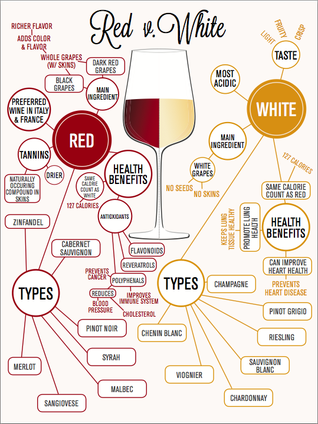
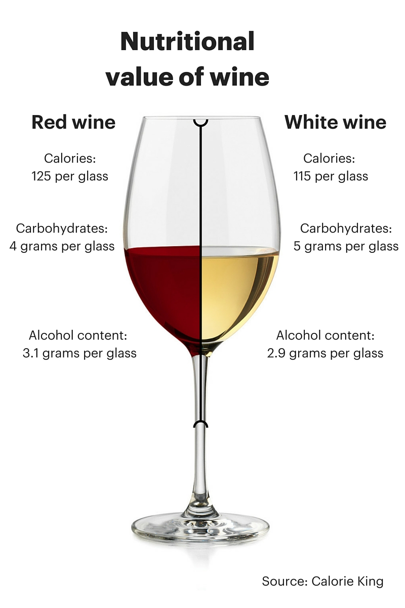

# Wine Quality Prediction with Machine Learning and Streamlit
This project predicts the quality of wines based on physicochemical features using machine learning techniques and provides interactive visualization and analysis through a Streamlit web application.

## Overview
The goal of this project is to develop a predictive model that can accurately assess the quality of wines based on various physicochemical properties. The model is deployed using Streamlit to create an intuitive and interactive interface for users to input wine characteristics and visualize predictions and analysis.

## Dataset
The dataset used for training and evaluation is the Wine Quality dataset, which contains samples of red and white wines. Each sample is described by 11 input variables, including fixed acidity, volatile acidity, citric acid, residual sugar, chlorides, free sulfur dioxide, total sulfur dioxide, density, pH, sulphates, and alcohol. The target variable, quality, is a rating between 3 and 8.
The dataset can be found at [link to dataset].

## Methodology
**Data Preprocessing**: The dataset is cleaned and preprocessed to handle missing values, outliers, and categorical variables. Feature scaling and encoding are applied as necessary.

**Exploratory Data Analysis (EDA)**: We conduct EDA to understand the distribution of features, identify correlations, and gain insights into the relationships between input variables and wine quality.

**Model Building**: Various machine learning models such as Random Forest, Support Vector Machine, and Gradient Boosting are trained on the preprocessed data to predict wine quality. Hyperparameter tuning and cross-validation are used to optimize model performance.

**Model Evaluation**: The trained models are evaluated using appropriate metrics such as accuracy, precision, recall, and F1-score. Visualization techniques such as confusion matrices and ROC curves are used to assess model performance.

**Streamlit Deployment**: The best-performing model is deployed using Streamlit, allowing users to input wine characteristics and receive quality predictions in real-time. Interactive visualizations such as scatter plots, bar charts, and heatmaps are provided to enhance user experience and interpretability.

# Data Analysis
## EDA-Whitewine
 In wine production, achieving the right balance of acidity and density is crucial for producing wines with complexity and depth of flavor. High fixed acidity can contribute to tartness and crispness, while density can affect the body and texture of the wine. 

 Wines with higher residual sugar content tend to have higher densities due to the added mass from dissolved sugars.

 Chlorides are a measure of salt content in wine, and their presence can affect the density of the liquid.
High chloride levels may slightly increase the density of wine, but the effect is usually minimal compared to other components like sugars and alcohol.

Sulfur dioxide is often added to wine as a preservative, and its concentration is typically low relative to other components.
While SO2 may contribute to the overall density of wine to some extent, its effect is usually overshadowed by other factors such as sugars, alcohol, and dissolved solids.

## Box-plot-whitewine
 This provides insights into the relative importance of different wine characteristics in predicting quality, with acidity-related features appearing to have a more significant impact. The numerical values suggest that acidity-related features are relatively more important in predicting wine quality compared to other features like density, pH, or sulphates.

## Heatmap-whitewine

**Positive Correlation:** Values close to 1 indicate a strong positive correlation between the corresponding features. For example, a correlation coefficient of 0.85 between citric acid and residual sugar suggests a strong positive correlation between these two features.

**Negative Correlation:** Values close to -1 indicate a strong negative correlation between the corresponding features. For example, a correlation coefficient of -0.8 between quality and alcohol suggests a strong negative correlation between these two features.

**No Correlation:** Values close to 0 indicate no correlation between the corresponding features. For example, a correlation coefficient of -0.017 between pH and density suggests no significant correlation between these two features.

## LR-Classification report-whitewine

Based on the classification report for a logistic regression model, we observe an overall accuracy of 58%.

* Precision class indicate that when the model predict an excellent or very bad quality, it is correct 0.63, 0.56, 0.61 times. 
  
* Recall means the model correctly identifies  52% 76% 23% of the actual instances of excellent or very bad quality

## WhiteWine_modelDF

**Numerical Values (e.g., 0.8, 0.7, etc.):** These values likely represent performance metrics such as accuracy, precision, recall, F1-score, or any other evaluation metric for each respective model.

**Machine Learning Models (e.g., Logistic Regression, KNN, etc.):** These are the names of the machine learning algorithms or models being evaluated.

**Interpretation:** The numerical values indicate the performance of each model according to the specified metric(s). For example, if the values represent accuracy, then a value of 0.8 for Logistic Regression indicates an accuracy of 80% for that model.

**Comparison:** You can compare the performance of different models based on the numerical values provided. Higher values typically indicate better performance, but it depends on the specific metric being used and the context of the problem.

**Selection of Best Model:** Based on these values, you can identify which model performs best according to the chosen metric(s). For example, if accuracy is the metric of interest, the model with the highest accuracy value would be considered the best performing model.

**Consideration of Multiple Metrics:** It's important to consider multiple metrics and not rely solely on one metric to evaluate model performance. Different metrics provide different insights into a model's performance, and it's essential to understand the trade-offs between them.

## Features
**Prediction Input**: Users can input wine characteristics such as acidity, sugar content, and alcohol level to receive quality predictions.

**Interactive Visualizations**: Various plots and charts are generated to visualize the distribution of features, feature importance, and model performance metrics.

**Model Analysis**: Users can explore model predictions, examine feature importance, and gain insights into the factors affecting wine quality.

## Usage
Install the required dependencies listed in `requirements.txt`.
Run the Streamlit application using the command `streamlit run app.py`.
Access the application via the provided URL and interact with the interface to input wine characteristics and explore predictions and analysis.

## Future Improvements
Incorporate additional features or data sources such as wine origin or production process to improve prediction accuracy.
Experiment with advanced machine learning algorithms or ensemble techniques to further enhance model performance.
Enhance the user interface and visualization capabilities of the Streamlit application based on user feedback.

## Contributors
[Adwoa & Owura]

## License
This project is licensed under the [License Name] License - see the [LICENSE.md](LICENSE.md) file for details.
---
Feel free to customize this template according to your specific project details and requirements!

